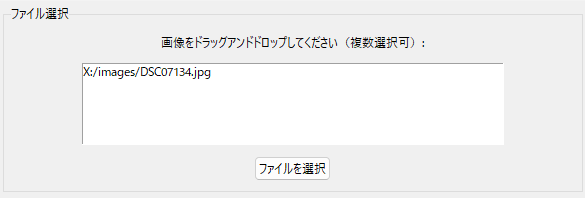
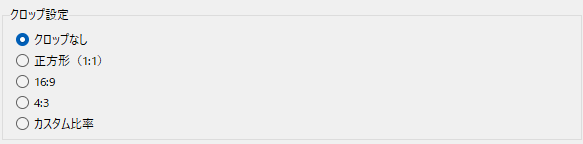
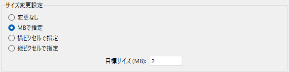
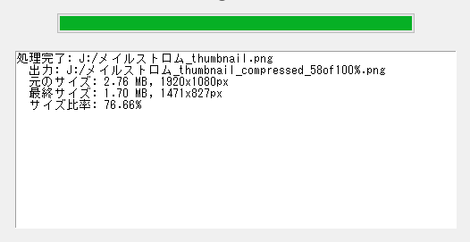

# ImageSizer

画像のリサイズ、クロップ、フォーマット変換を行うGUIアプリケーションです。SNSヘッダーやWeb用画像のプリセットを備え、複数の画像をまとめて処理できます。


## 主な機能

### 画像処理機能
- **リサイズ**: ファイルサイズ（MB）または画素数（幅/高さ）で指定
- **クロップ**: 正方形、16:9、4:3、9:16、カスタム比率に対応
- **フォーマット変換**: WebP、PNG、元のフォーマット維持
- **バッチ処理**: ドラッグ&ドロップで複数画像を一括処理
- **自動調整**: 目標サイズに応じて自動的に拡大・圧縮

### プリセット機能
便利なプリセットサイズを搭載：
- **SNSヘッダー**: 
  - X (Twitter): 1500x500
  - note: 1280x670
  - YouTube: 2048x1152
- **Web画像**: 
  - メインビジュアル: 1600px幅
  - プロジェクト詳細: 1200px幅
  - サムネイル: 400px幅
- **SNS投稿**: 
  - Instagram正方形: 1080x1080
  - Instagram縦長: 1080x1350
  - Instagramストーリー: 1080x1920

### ファイル名カスタマイズ
出力ファイル名に以下の情報を含めることができます：
- クロップタイプ（クロップ時のみ）
- サイズ比率（サイズ変更時のみ）
- タイムスタンプ（YYYYMMDD_HHMMSS）
- 連番（001, 002, ...）
- プリセット名（プリセット使用時のみ）

### その他の機能
- ウィンドウを常に最前面に表示
- ウィンドウのサイズと位置を記憶
- 設定の自動保存・復元
- 処理進捗のリアルタイム表示

## 対応フォーマット

ImageSizer は以下の画像フォーマットに対応しています：

- PNG (.png)
- JPEG (.jpg, .jpeg)
- BMP (.bmp)
- TIFF (.tiff)
- WebP (.webp)

注意：GIF (.gif) ファイルは処理されません。

## 要件

- Python 3.6以上
- 以下のPythonライブラリ:
  - tkinter
  - Pillow (PIL)
  - tkinterdnd2

## インストール方法

1. このリポジトリをクローンまたはダウンロードします。（ページ上部、緑色の「<>Code▼」ボタンから選択）
2. お使いのPCに必要なライブラリをインストールします：

   ```bash
   pip install pillow tkinterdnd2
   ```

3. `python main.py` を実行してアプリケーションを起動します。

## プロジェクト構成

- `main.py`: アプリケーションのエントリーポイント
- `image_processor.py`: 画像処理のコア機能
- `gui.py`: ユーザーインターフェース
- `settings.json`: 設定ファイル（自動生成）

## 使用方法

1. アプリケーションを起動します。

2. プリセットを選択するか、カスタム設定を行います：
   - プリセットドロップダウンから適切な設定を選択
   - またはカスタムでクロップ・サイズを設定

   

3. 以下のいずれかの方法で画像を追加します：
   - 画像ファイルをウィンドウにドラッグアンドドロップ
   - 「ファイルを選択」ボタンをクリックして画像を選択

4. クロップ設定（カスタムの場合）：
   - クロップなし
   - 正方形（1:1）
   - 16:9
   - 4:3
   - 9:16
   - カスタム比率（縦横比を指定）

   

5. サイズ設定（カスタムの場合）：
   - 変更なし：サイズ変更を行わない
   - MBで指定：ファイルサイズで指定
   - 横ピクセルで指定：画像の幅で指定
   - 縦ピクセルで指定：画像の高さで指定

   

6. 出力フォーマットを選択：
   - 元のフォーマットを維持
   - WebP形式に変換（高圧縮・高品質）
   - PNG形式に変換

7. ファイル名パターンを設定：
   必要な情報にチェックを入れます

8. 画像をドロップまたは選択すると、処理が自動的に開始されます。

   

## 設定ファイル

アプリケーションの設定は `settings.json` ファイルに自動的に保存され、次回起動時に復元されます。
設定ファイルには以下の項目が含まれます：

- 最前面表示の状態
- クロップタイプ
- サイズ設定
- 出力フォーマット
- ウィンドウサイズと位置

初めて使用する場合は、`settings.json.template` を `settings.json` にコピーしてください：

```bash
cp settings.json.template settings.json
```

## 注意事項

- GIF画像は処理されません
- 処理された画像は元のファイルと同じフォルダに保存されます
- 既存のファイルは上書きされません（連番が付与されます）
- クロップ機能を使用すると、画像の一部が切り取られます
- WebP形式に変換する場合、RGBA画像は自動的にRGBに変換されます