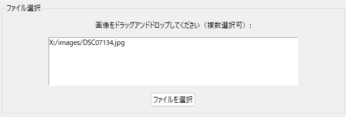
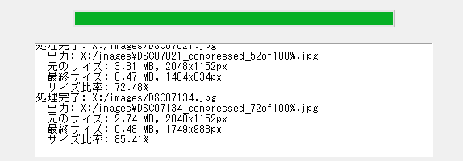

# ImageSizer

ImageSizer は、画像のサイズを簡単に調整できる Python アプリケーションです。
ドラッグアンドドロップのインターフェースを使用して、複数の画像を一度に処理できます。


## 主な機能

- 画像の圧縮と拡大
- MBまたはピクセル単位でのサイズ指定
- 自動、圧縮、拡大モードの選択
- ドラッグアンドドロップによる簡単な操作
- 複数画像の一括処理
- 処理状況のリアルタイム表示
- 画像のクロップ機能
- カスタム縦横比の設定

## 対応フォーマット

ImageSizer は以下の画像フォーマットに対応しています：

- PNG (.png)
- JPEG (.jpg, .jpeg)
- BMP (.bmp)
- TIFF (.tiff)

注意：GIF (.gif) ファイルは処理されません。

## 要件

- Python 3.6以上
- 以下のPythonライブラリ:
  - tkinter
  - Pillow (PIL)
  - tkinterdnd2

## インストール方法

1. リポジトリをクローンまたはダウンロードします。
2. 必要なライブラリをインストールします：

   ```bash
   pip install pillow tkinterdnd2
   ```

3. `python imagesizer.py` を実行してアプリケーションを起動します。

## 使用方法

1. アプリケーションを起動します。
2. 以下のいずれかの方法で画像を追加します：
   - 画像ファイルをウィンドウにドラッグアンドドロップ
   - 「ファイルを選択」ボタンをクリックして画像を選択

   

3. クロップ設定を選択します：
   - クロップなし
   - 正方形（1:1）
   - 16:9
   - 4:3
   - カスタム比率（縦横比を指定）

   

4. サイズタイプを選択します：
   - 変更なし：サイズ変更を行わない
   - MB：ファイルサイズで指定
   - 縦ピクセル：画像の高さで指定
   - 横ピクセル：画像の幅で指定

5. 目標サイズを入力します（サイズタイプが「変更なし」以外の場合）。

   

6. 操作モードを選択します：
   - 自動調整：現在のサイズに応じて自動的に圧縮または拡大
   - 圧縮：指定したサイズまで圧縮
   - 拡大：指定したサイズまで拡大

   

7. 画像をドロップするか「ファイルを選択」ボタンで追加すると、処理が自動的に開始されます。進行状況とログがウィンドウに表示されます。

   

## 注意事項

- GIF画像は処理されません。
- 処理された画像は元のファイルと同じフォルダに保存されます。
- ファイル名には処理タイプとサイズ比率が追加されます。
- クロップ機能を使用すると、画像の一部が切り取られる可能性があります。

## ライセンス

このプロジェクトはMITライセンスの下で公開されています。詳細については `LICENSE` ファイルを参照してください。